

# ARIS Grading System Interface

   

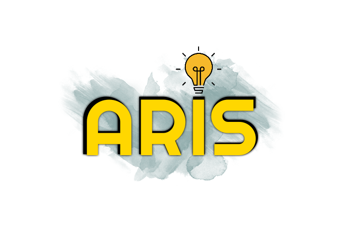

**Grading system user interface design.** _(student view)_

## Some Screenshots

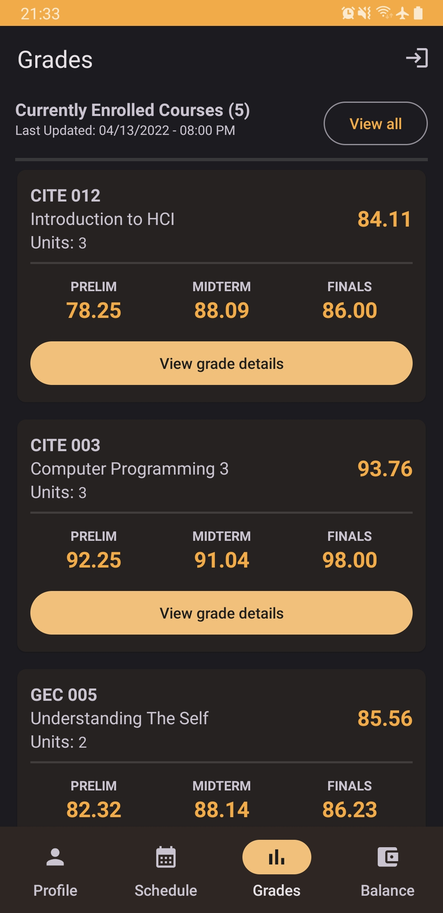
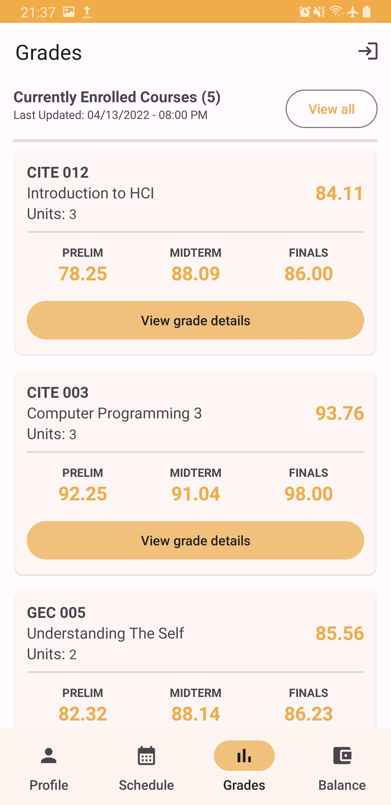
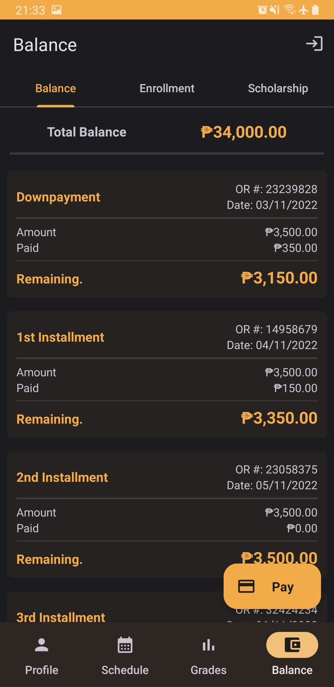
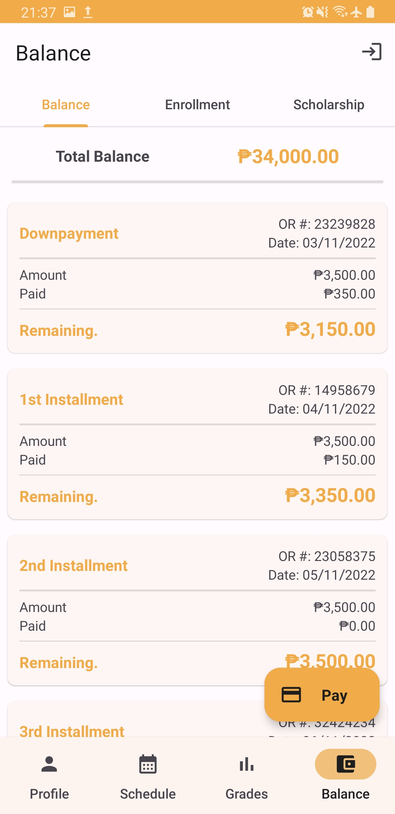
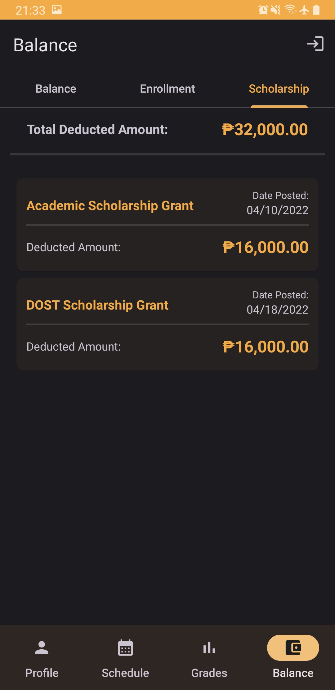
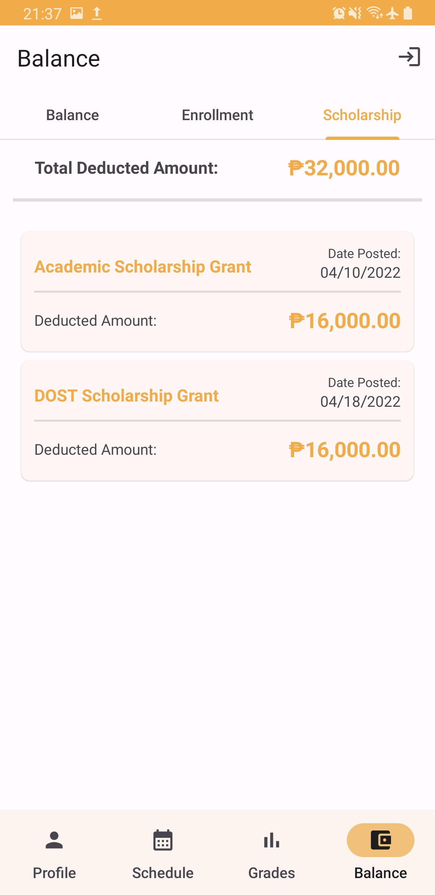
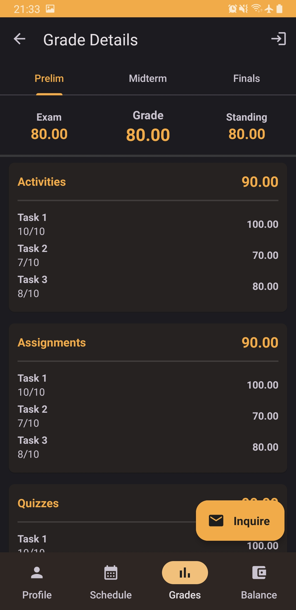
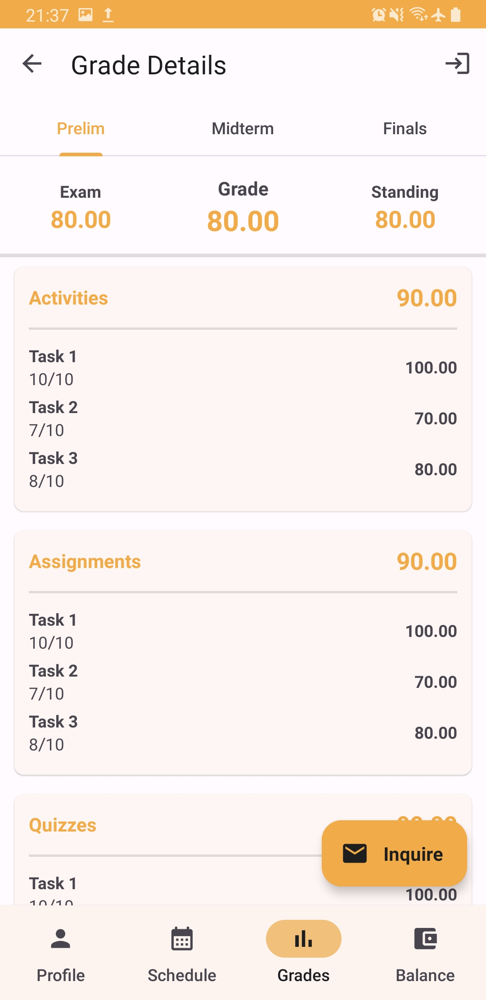
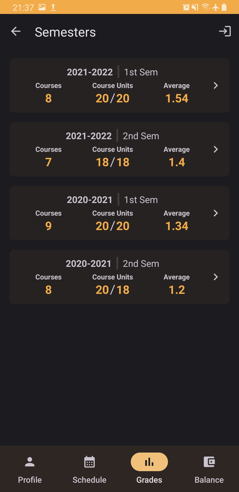
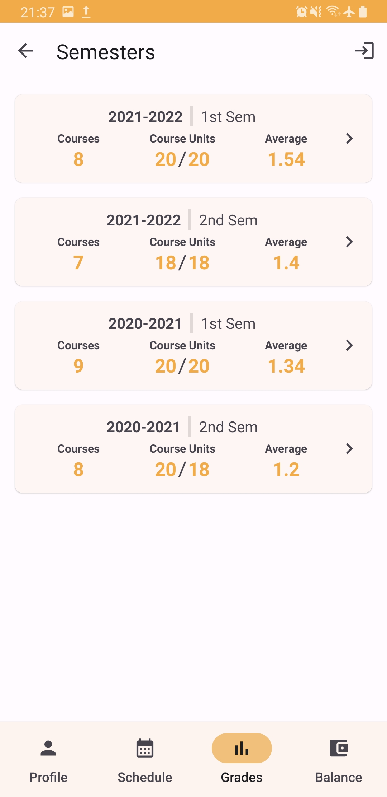

> Material Design 3 | https://m3.material.io

## Features

Student can view the following:

- Profile
- School year and semester
- Courses/subjects taken per semester
- Grades per subject
- Remaining balance
- Add email inquiries to your professors regarding the computed grades. No processing of email only
  the user interface.

## Scope

The flow of your application should portray:

- Target users
- Smooth flow of the process
- Should be able to show normal flow and alternate flow
- Should be able to show exemptions/error messages
- Should be able to show how the application looks on different devices (models)

> **NOTE:** No need to save the transactions to a database because it is not covered in this course. Focus on the design and on user experience

## Constraints

- No real-time processing required (database). If ever you know how to use cloud databases/API, it
  will not be part of the grading and requirements.

## License

This work is distributed under [MIT License](./LICENSE.txt).
